# goAgenda

> 基于cobra工具编写的CLI程序
>
> [课程网站](https://pmlpml.github.io/ServiceComputingOnCloud/ex-cli-agenda)

### 安装cobra

使用以下命令安装

```/
go get -v github.com/spf13/cobra/cobra
```

会出现以下错误信息：

> Fetching https://golang.org/x/sys/unix?go-get=1
>
> https fetch failed: Get https://golang.org/x/sys/unix?go-get=1: dial tcp 216.239.37.1:443: i/o timeout

解决办法是：进入`$GOPATH/src/golang.org/x`目录下，执行：

```
git clone https://github.com/golang/sys.git
git clone https://github.com/golang/text.git
```

然后执行`go install github.com/spf13/cobra/cobra`完成安装。可以看到`$GOBIN`下出现了cobra的可执行程序。

### 项目创建

使用命令`cobra init goAgenda --pkg-name goAgenda`创建项目。

### 项目设计

Agenda原来是一个较为完整的程序，用于管理人员和会议信息。但因为作业要求变更，现只需实现两条指令即可。所以本程序选取了最为基本的三条指令：

+ 用户注册：userRegister
+ 用户登录：userLogin
+ 用户登出：userLogout

### 数据持久化

对于用户数据的持久保存，选择将用户信息保存为JSON格式。Go语言中提供了JSON包的支持，导入`encoding/json`包即可。参考：[JSON and Go](https://blog.go-zh.org/json-and-go)

##### 用户信息结构体

```go
type User struct{
	Username string
	Password string
	Email string
	Telephone string
}
```

##### Encoding：写入JSON文件

使用`func Marshal(v interface{}) ([]byte, error)`函数可将结构体转为JSON数据，然后再写入文件

```go
func WriteToFile(filePath string, users []User) error{
	if data, err := json.Marshal(users); err == nil{
		return ioutil.WriteFile(filePath, []byte(data), os.ModeAppend)
	}else{
		return err
	}
}
```

##### Decoding：读取JSON文件

使用`func Unmarshal(data []byte, v interface{}) error`函数进行解码

```go
func ReadFromFile(filePath string) ([]User, error){
	var users []User
	str, err := ioutil.ReadFile(filePath)
	if err != nil {
		return users, err
	}
	jsonStr := string(str)

	json.Unmarshal([]byte(jsonStr), &users)
	return users, err
}
```

### 设计分析

#### 项目目录

```/
├── cmd 
│ 	├── root.go 
│ 	├── userLogin.go		// 用户登入
│ 	├── userLogout.go		// 用户登出
│ 	├── userRegister.go		// 用户注册
├── data
│ 	├── agendaLog.log		// 日志文件
│ 	├── curUser.json		// 存储当前登录的用户信息
│ 	├── userList.json		// 存储所有注册用户信息
├── entity	
│ 	├── users.go			// JSON相关操作
├──  logger
│ 	├── log.go				// 日志相关操作
├── .travis.yml
├── LICENSE
├── main.go					// 程序入口文件
├── README.md
```

#### 功能实现

`main.go`和`root.go`文件都是cobra工具生成的，在这里就不赘述了。

##### 用户注册

用户注册的代码逻辑就是简单的获取用户的输入信息，得到用户名、密码、邮箱和手机号码，然后`registerCheck`函数判断这些信息有没有缺失、有没有重复，若有错则输出错误信息，没有错就把新用户写入JSON文件，提示注册成功。所有提示信息都会同步写入Log文件。

`validEmail`和`validPhone`函数通过正则表达式验证邮箱和11位手机号码是否合法。

```go
package cmd

import (
	"fmt"
	"github.com/DanielXuuuuu/goAgenda/entity"
	"github.com/DanielXuuuuu/goAgenda/logger"
	"github.com/spf13/cobra"
	"errors"
	"regexp"
)

const userDataFile = "./data/userList.json"

// userRegisterCmd represents the userRegister command
var userRegisterCmd = &cobra.Command{
	Use:   "userRegister",
	Short: "user register",
	Long: "userRegister:\n  users are registered to the system by enter their name, password, email and phoneNumber ",
	Run: func(cmd *cobra.Command, args []string) {
		logger.WriteLog("[INFO] ", "userRegister called")
		users, err := entity.ReadFromFile(userDataFile)
		if err != nil {
			fmt.Println(err)
			return
		}
		username, _ := cmd.Flags().GetString("name")
		password, _:= cmd.Flags().GetString("password")
		email, _:= cmd.Flags().GetString("email")
		telephone, _ := cmd.Flags().GetString("telephone")
		
		if legal, err := registerCheck(users, username, password, email, telephone); !legal && err != nil {
			fmt.Println(err)
			logger.WriteLog("[ERROR] ", err.Error())
			logger.WriteLog("[INFO] ", "Register failed")
			return
		}
		
		newUser := entity.User{username, password, email, telephone}
		users = append(users, newUser)

		entity.WriteToFile(userDataFile, users)
		fmt.Println("New account register successfully!")
		logger.WriteLog("[INFO] ", "Register succeessfully")
	},
}

func registerCheck(users []entity.User, username string, password string, email string, telephone string) (bool, error) {
	if len(username) == 0{
		return false,errors.New("username missing")
	}else if len(password) == 0 {
		return false,errors.New("password missing")
	}else if len(email) == 0 {
		return false,errors.New("email missing")	
	}else if !validEmail(email){
		return false,errors.New("invalid email address")
	}else if len(telephone) == 0 {
		return false,errors.New("telephone missing")			
	}else if !validPhone(telephone){
		return false,errors.New("invalid phone number")
	}

	for _,user := range users {
		if user.Username == username {
			return false, errors.New("username existed")
		}else if user.Email == email {
			return false, errors.New("email registered")
		}else if user.Telephone == telephone {
			return false, errors.New("username registered")
		}
	}
	return true, nil
}

func validEmail(email string) (bool) {
	reg := regexp.MustCompile(`^\w+([-+.]\w+)*@\w+([-.]\w+)*\.\w+([-.]\w+)*$`)
    return reg.MatchString(email)
}

func validPhone(phone string) (bool) {
	reg := regexp.MustCompile("^(13[0-9]|14[579]|15[0-3,5-9]|16[6]|17[0135678]|18[0-9]|19[89])\\d{8}$")
    return reg.MatchString(phone)
}


func init() {
	rootCmd.AddCommand(userRegisterCmd)

	userRegisterCmd.Flags().StringP("name", "n", "", "user's name")
	userRegisterCmd.Flags().StringP("password", "p", "", "user's password")
	userRegisterCmd.Flags().StringP("email", "e", "", "user's email")
	userRegisterCmd.Flags().StringP("telephone", "t", "", "user's phone number")
}

```

##### 用户登录

用户登录代码逻辑类似，首先获得登录的用户名和密码，然后通过`loginCheck`函数检查是否已经登录、信息是否完整、用户名和密码是否能找到匹配项，并在屏幕和log中输出相应的提示信息。若登录成功，就在`data/curUser.json`文件写入登入用户信息。

```go
package cmd

import (
	"fmt"
	"github.com/DanielXuuuuu/goAgenda/entity"
	"github.com/DanielXuuuuu/goAgenda/logger"
	"github.com/spf13/cobra"
	"errors"
)

const curUserFile = "./data/curUser.json"
var curUser []entity.User

// userLoginCmd represents the userLogin command
var userLoginCmd = &cobra.Command{
	Use:   "userLogin",
	Short: "user login",
	Long: "userLogin:\n  registered user login with username and password",
	Run: func(cmd *cobra.Command, args []string) {
		logger.WriteLog("[INFO] ", "userLogin called")
		users, err := entity.ReadFromFile(userDataFile)
		if err != nil {
			fmt.Println(err)
			return
		}
		username, _ := cmd.Flags().GetString("name")
		password, _:= cmd.Flags().GetString("password")

		if flag, err := loginCheck(users, username, password); flag == true{
			fmt.Println("Login successfully, welcome! " + username + ".")
			logger.WriteLog("[INFO] ", "Login successfully")
		}else{
			fmt.Println(err);
			logger.WriteLog("[ERROR] ", err.Error())
			logger.WriteLog("[INFO] ", "Login failed")
		}
	},
}

func loginCheck(users []entity.User, username string, password string)(bool, error){
	if curUser, err := entity.ReadFromFile(curUserFile); err != nil {
		return false, err
	}else if len(curUser) != 0{
		return false, errors.New("already login") 
	}

	if len(username) == 0 {
		return false, errors.New("missing username")
	}else if len(password) == 0 {
		return false, errors.New("missing password")
	}

	for _,user := range users {
		if user.Username == username && user.Password == password {
			curUser = append(curUser, user)
			entity.WriteToFile(curUserFile, curUser)
			return true, nil
		}
	}
	return false, errors.New("incorrect username or password, please check and try again!")
}

func init() {
	rootCmd.AddCommand(userLoginCmd)

	userLoginCmd.Flags().StringP("name", "n", "", "user's name")
	userLoginCmd.Flags().StringP("password", "p", "", "user's password")
}

```

##### 用户登出

用户登出比较简单，无需参数，首先检查是否是登入状态，若还没登入就执行登出，则报错；若已经是登录状态，就提示登出成功，并将`data/curUser.json`文件置空。

```go
package cmd

import (
	"fmt"
	"github.com/DanielXuuuuu/goAgenda/entity"
	"github.com/DanielXuuuuu/goAgenda/logger"
	"github.com/spf13/cobra"
)

// userLogoutCmd represents the userLogout command
var userLogoutCmd = &cobra.Command{
	Use:   "userLogout",
	Short: "user logout",
	Long: "userLogout:\n  logined user logout",
	Run: func(cmd *cobra.Command, args []string) {
		logger.WriteLog("[INFO] ", "userLogout callled")
		if curUser, err := entity.ReadFromFile(curUserFile); err != nil {
			fmt.Println(err)
		}else if len(curUser) == 0{
			fmt.Println("please login first")
			logger.WriteLog("[ERROR] ", "Logout before login")
			logger.WriteLog("[INFO] ", "Logout failed")
		}else {
			fmt.Println("Logout successfully. Bye! " + curUser[0].Username + ".")
			logger.WriteLog("[INFO] ", "Logout successfully")
			var empty []entity.User
			entity.WriteToFile(curUserFile, empty)
		}
	},
}

func init() {
	rootCmd.AddCommand(userLogoutCmd)
}

```

##### 日志

日志操作调用`log`包，`WriteLog`接收相应的log信息前缀和内容，前缀包括`[INFO]`和`[ERROR]`，然后写入对应文件。

```go
package logger

import (
	"fmt"
	"log"
	"os"
)

const logFile = "./data/agendaLog.log" 

func WriteLog(prefix string, content string){
	var logHelper *log.Logger
	file, err := os.OpenFile(logFile,  os.O_RDWR |  os.O_APPEND | os.O_CREATE, 0644)
	if err != nil{
		fmt.Print(err)
	}
	defer file.Close()
	logHelper = log.New(file, prefix, log.Ldate | log.Ltime)
	logHelper.Println(content)
}
```

##### JSON数据保存

见本文**数据持久化**部分

##### 持续集成：.travis.yml文件

> 持续集成：Continuous Integration，简称CI，意思是，在一个项目中，任何人对代码库的任何改动，都会触发CI服务器自动对项目进行构建，自动运行测试，甚至自动部署到测试环境。这样做的好处就是，随时发现问题，随时修复。因为修复问题的成本随着时间的推移而增长，越早发现，修复成本越低。
>
> [参考网站](https://studygolang.com/articles/11250)

```go
language: 
  - go

go: 
  - "1.x"
  - "1.13"
  - "1.13.x"

script:
  - go get -v
  - go test -v ./...

notifications:
  email:
    recipients:
      - 979223119@qq.com
    on_success: change
    on_failure: always
```

### 程序测试

使用`go build`命令生成可执行文件进行测试。使用`go build`的好处是生成的可执行文件在当前目录下，因此不需要更改我们在之前使用`go run`进行测试时文件所用到的一些相对路径。如果使用`go install`会在`$GOPATH/bin`文件下生成可执行文件，这是一些相对路径会失效。

执行`./goAgenda help`可以查看程序使用方法

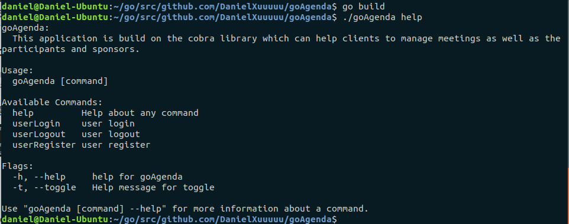

#### userRegister

##### 查看帮助

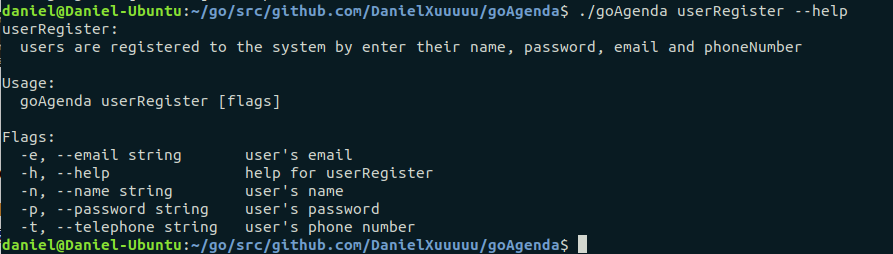

##### 注册用户

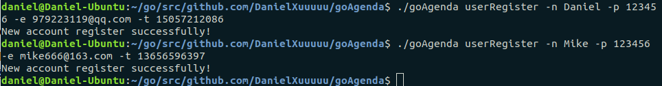

以上我们成功注册两个用户，查看`data/userList.json`文件可以看到两个用户的信息都已按照JSON格式保存，如下图：

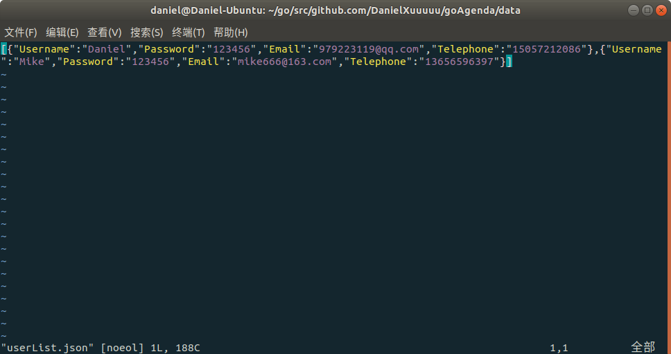

以下是一些错误尝试，例如：用户名重复、邮箱已被注册、手机不正确等等，会输出相应的错误信息

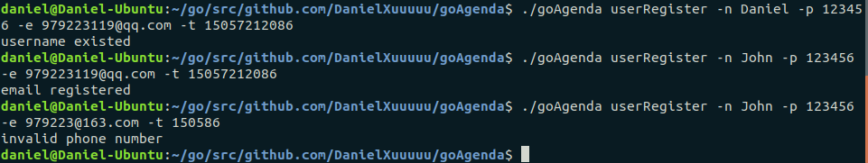

#### userLogin

##### 查看帮助

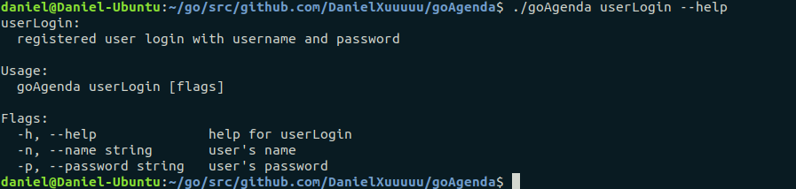

##### 用户登录

使用已注册用户登录

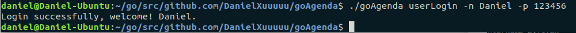

再次登录会提示已登录

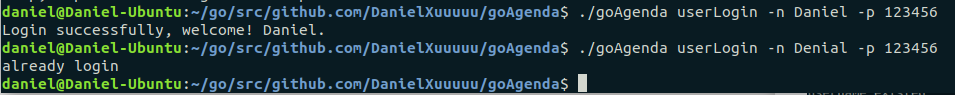

查看`data/curUser.json`文件可以看到当前登录的用户信息，如下图：

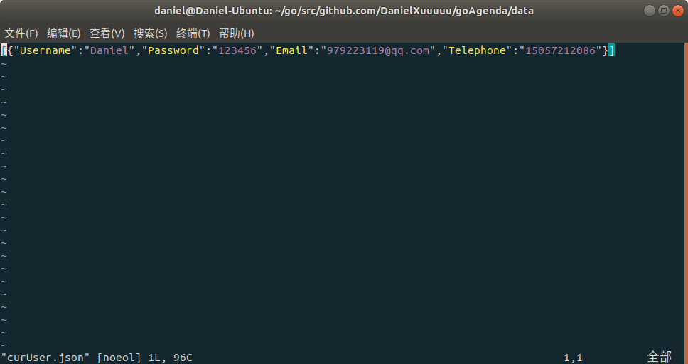

这里我们先登出，尝试使用错误的用户名和密码登录，会输出用户名或密码错误的提示信息。（登出的命令后面会提到）

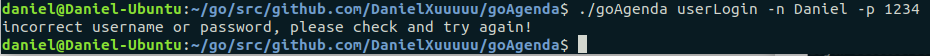

#### userLogout

##### 查看帮助

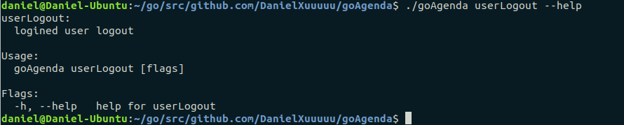

##### 用户登出

我们首先登录，然后执行登出命令，可以看到登出成功。若没有登入就执行登出命令，则会输出错误提示。

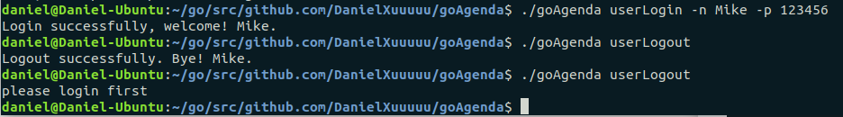

登出后`data/curUser.json`文件中为空。

#### Log

查看`data/agendaLog.log`文件，可以查看到上述一系列命令的执行情况，便于后期查看。

PS：并不完全对应于上述所截图到的指令，因为我在截图外还执行了一些命令，但前述执行过的命令都可以在这找到对应的log信息。

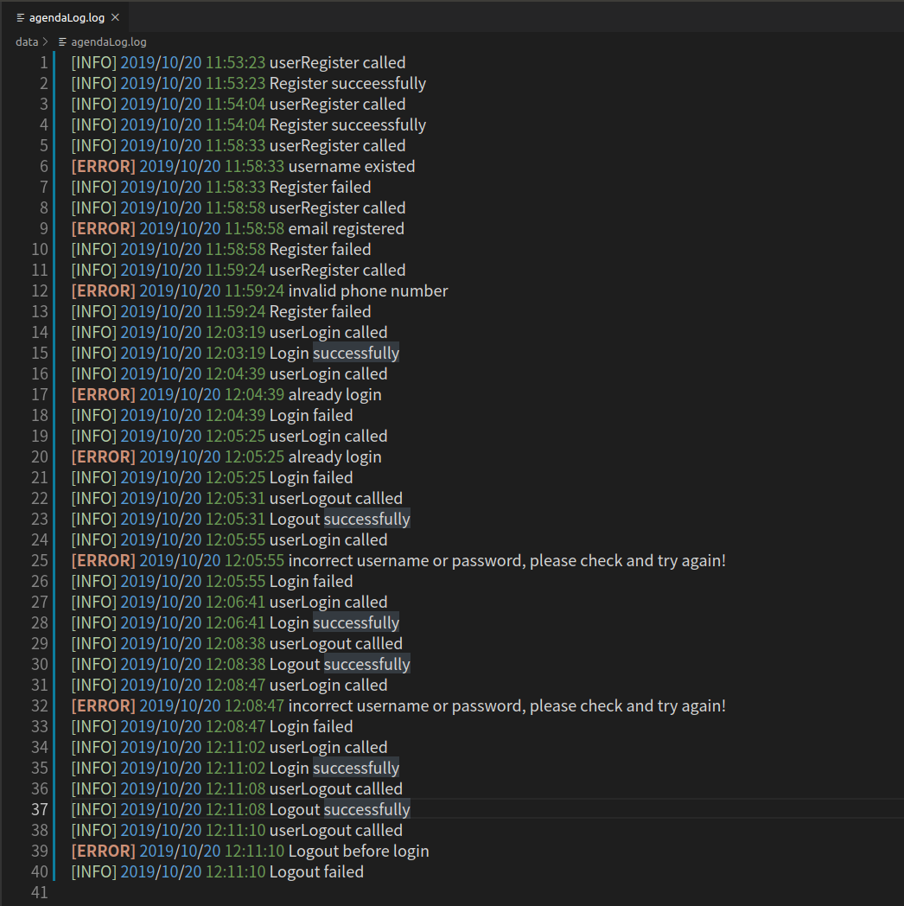